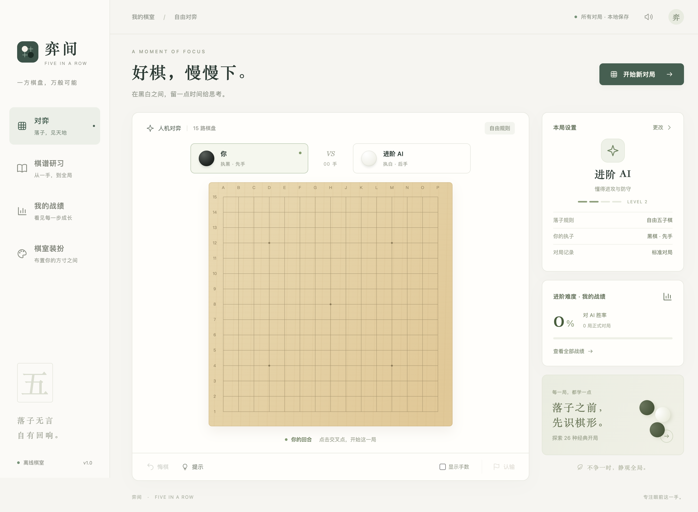

# 弈间 · Five in a Row

一方棋盘，万般可能。一个完全离线、中文界面的五子棋桌面游戏，支持 macOS 与 Windows。



## 下载游玩

在 [Releases](https://github.com/mashiro222/FiveinaRow/releases) 下载对应平台的安装包：

- **Apple Silicon Mac（M 系列芯片）**：`mac-arm64.dmg`，打开后把游戏拖到 Applications。
- **Intel Mac**：`mac-x64.dmg`。
- **Windows 64 位**：`.exe` 安装包或便携版。安装包文件名带 `Setup`，便携版带 `Portable`。

当前版本未购买开发者签名证书，也未做 Apple 公证。macOS 首次运行若被 Gatekeeper 拦截，请在尝试打开后，进入「系统设置 → 隐私与安全性 → 仍要打开」。Windows 可能显示 SmartScreen 提示。不要关闭系统的全局安全保护。

所有棋盘、字体回退、音效、AI 与棋谱均在应用内；游玩无需账号或网络。

## 功能

- **同屏双人**：两人轮流落子；不包含联机功能。
- **四档 AI**：入门、进阶、高手、挑战。入门使用带随机性的棋形评估，其余使用候选剪枝、迭代加深与 Alpha-Beta 搜索；分别限制搜索层数和思考时间。后台 Web Worker 运算，不阻塞界面。AI 是本地算法，不调用在线模型，也不是职业级连珠引擎。
- **本机战绩**：按 AI 难度统计胜、负、和与胜率；保留最近 1,000 局，可复盘、导出 JSON；当前未完成对局自动恢复。
- **四套主题**：松间木纹、课间草稿纸、夜阑石板、竹影浅青。棋盘、背景、棋子可独立搭配。草稿纸使用 ×（黑）和 ○（白）。音效和手数可关闭。
- **棋盘大小**：13 × 13、15 × 15、19 × 19；15 路为标准大小。其他尺寸的禁手属于同样局部判定规则的休闲扩展。
- **26 种经典开局**：直指与斜指各 13 种，提供前三手、先手思路、后手应对、教学续走和逐步演示；可执黑或执白接着与 AI 练习。
- **可选黑棋禁手**：三三、四四、长连。区分同一活四的两个成五点、同方向多个四、断三、假三，以及延伸点本身形成禁手的情况。
- **辅助功能**：悔棋、落子提示、认输、胜利连线、键盘方向键移动焦点、Enter / Space 落子。

## 规则与统计口径

自由规则下，双方连续五子或更多即获胜。启用禁手后，黑棋必须恰好连五，白棋连五及长连均胜。黑棋同时形成恰好五连时，按 RIF 第 9.2 条优先判胜。活三判定递归检验扩展为活四的落点是否合法。禁手落点被拦截，玩家可以重新选点，**不是比赛中落下禁手直接判负的处罚方式**。如黑棋无合法落点则判负。

本应用使用自由落子开局，**没有实施三手交换、五手两打、Swap2 或其他比赛开局协议**，因此不称为完整的 RIF 竞赛模式。

正式胜率 = 正式胜局 ÷ 正式对局数（含和棋）。使用提示、悔棋、开局练习的对局标记为练习，不计正式胜率。同屏双人不计 AI 战绩。认输计入结果；放弃未结束的对局并新开一局不计胜负。当前按难度汇总不同执子、尺寸和禁手设置，历史记录中保留这些信息。

开局前三手和名称核对自 [Renju International Federation 开局图](https://www.renju.net/openings/)。第 4–6 手及文字建议是自编教学示例，**不是经过求解器认证的最优定式**。本库没有完整开局必胜证明，因此不把某个开局名称标记为“保证获胜”。规则参考 [RIF International Rules of Renju](https://www.renju.net/rifrules/)，重点参见第 3、9 节。

## 开发运行

需要 Node.js 24 或更新的兼容版本，以及 pnpm 11.25.0。

```sh
npm install -g pnpm@11.25.0
pnpm install
pnpm start
```

浏览器预览（桌面程序无需此服务）：

```sh
pnpm dev
# 打开 http://127.0.0.1:5173
```

## 测试与打包

```sh
pnpm test          # 规则、AI、开局数据、对局状态与统计测试
pnpm test:ui       # 真正启动 Electron 窗口的端到端测试；需桌面环境
pnpm dist:mac      # 在 Mac 上生成 .dmg / .zip
pnpm dist:win      # 建议在 Windows 上生成 NSIS 安装版和便携版
```

输出目录为 `release/`。`pnpm test:ui` 会清空测试进程的本机存档，测试进程使用独立的临时数据目录，不影响正常游戏战绩。截图写入 `test-results/`。

GitHub Actions 对提交运行测试，分别生成 macOS ARM64、macOS x64 与 Windows x64 下载产物。推送 `v*` 标签后，在所有构建成功时自动创建 GitHub Release 并上传安装包。未配置签名证书时使用未公证、未正式签名的分发包。

```sh
git tag v1.0.0
git push origin v1.0.0
```

## 项目结构

```text
src/engine.js      连五、四四、递归活三与禁手判定
src/ai.js          棋形评分、限时搜索与难度配置
src/ai-worker.js   AI 后台线程
src/state.js       对局、悔棋、战绩和存档
src/openings.js    26 种开局与教学内容
src/app.js         界面、操作和状态协调
src/style.css     主题与布局
electron/main.cjs 隔离沙箱窗口、本地自定义协议
```

运行时无远程资源、无遥测。Electron 渲染进程关闭 Node 集成，开启上下文隔离和沙箱。应用数据由 Electron 存在系统用户数据目录，卸载程序通常不会主动删除存档。导出的 JSON 是可读备份，当前版本不提供导入功能。

MIT License.
