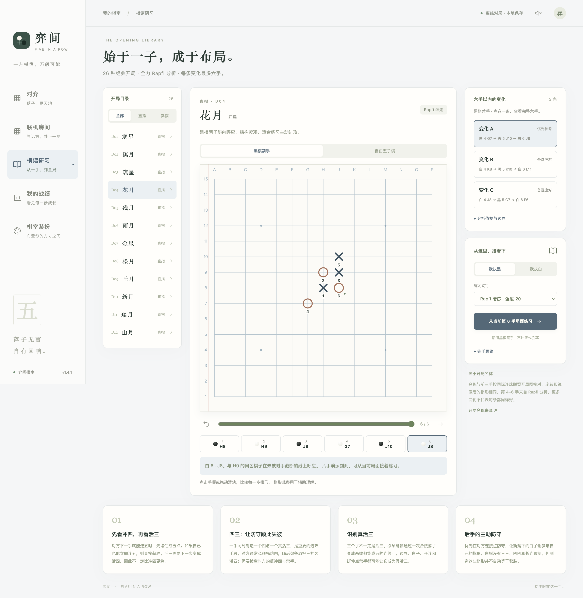

# 弈间 · Five in a Row

**一方棋盘，万般可能。**

一款让你慢下来、认真下一局的五子棋桌面游戏。与朋友同屏或联机对弈，也可以和离线 Rapfi AI 切磋、练习开局。

**先想一手，再看提示；悔棋重试，在与 AI 的对照中练习自己的判断。**

**简体中文** · [English](README.en.md)

[下载游戏](https://github.com/mashiro222/FiveinaRow/releases/latest) · [好友联机](docs/ONLINE.md) · [开发指南](docs/DEVELOPMENT.md) · [反馈问题](https://github.com/mashiro222/FiveinaRow/issues)

> **游戏界面目前为中文。** 中英文切换仅用于本项目的介绍文档。截图来自 v1.4.1。

## 下载，开始一局

打开 **[最新版本下载页](https://github.com/mashiro222/FiveinaRow/releases/latest)**，在 **Assets** 中选择对应文件，无需下载源码或安装开发工具。

| 你的电脑 | 下载文件 | 使用方式 |
| --- | --- | --- |
| Apple Silicon Mac（M 系列芯片） | `Five-in-a-Row-版本号-mac-arm64.dmg` | 打开后拖入 Applications |
| Intel Mac | `Five-in-a-Row-版本号-mac-x64.dmg` | 打开后拖入 Applications |
| Windows 64 位 | `Five-in-a-Row-版本号-win-x64-Setup.exe` | 运行安装程序 |
| Windows 64 位，免安装 | `Five-in-a-Row-版本号-win-x64-Portable.exe` | 下载后直接运行 |

应用免费、无需账号。AI、棋谱和主题随安装包提供，离线玩法无需网络。

首次打开时，系统出现安全提示？

当前安装包没有 Apple 开发者证书与公证，也没有 Windows 正式代码签名。Mac 包使用 ad-hoc 签名验证文件完整性。

请从本仓库 Releases 下载。macOS 尝试打开后若被拦截，可进入「系统设置 → 隐私与安全性 → 仍要打开」。Windows 可能显示 SmartScreen 提示。不要关闭系统的全局安全保护。

## 想怎么下，就怎么下

| 玩法 | 你可以做什么 |
| --- | --- |
| **同屏双人** | 和朋友共用一台电脑，轮流落子 |
| **好友联机** | 创建四位房号，取名入座；两人下棋，其他人旁观。支持禁手与每手 30 秒 / 60 秒 / 2 分钟限时 |
| **离线 AI** | 挑战全力 Rapfi，或选择强度 0–90 的陪练；默认陪练强度 20，可自行调低 |
| **提示与悔棋** | 用全力 Rapfi 的建议对照自己的落点，退回上一手尝试不同下法，在实战中练习攻防 |
| **棋谱研习** | 学习 26 种命名开局，比较 149 条六手变化，再从当前局面接着练习 |
| **棋室装扮** | 木纹、草稿纸、石板、浅青四种风格，棋盘、背景、棋子自由搭配；草稿纸可以用 × / ○ 落子 |
| **战绩与复盘** | 本机保存最近 1,000 局 AI 对战记录，陪练与全力分开统计，可回看棋谱、导出 JSON |

还有 13 / 15 / 19 路棋盘、黑棋禁手、手数显示、音效和键盘落子。人机禁手对局使用 15 路棋盘；好友联机固定为 15 路。

### 用提示与悔棋，把每一盘变成练习

在人机对局里，可以随时停下来比较：**我想下的位置，和 Rapfi 建议的位置有什么不同？**

1. **先自己想。** 轮到你时，先选一个候选落点，想想这一手要进攻还是防守。
2. **再看提示。** 点击「提示」，让全力 Rapfi 分析当前局面，标出建议落点，由你决定是否采纳。即使对手是低强度陪练，提示仍使用全力引擎，思考预算至少 10 秒。
3. **悔棋，再试一次。** 对局尚未结束时，「悔棋」会退回你上一次落子前；如果 AI 已经应手，也会一并撤回。你可以结合提示换一种下法，继续观察 AI 怎样应对。

可以用较弱的陪练保持对局节奏，在关键处借助全力提示校对判断，再重下几步，观察后续攻防的变化。提示给出的是落点建议，理解棋形仍需要自己观察和尝试。

**练习可以放开手脚：使用提示或悔棋后，本局标记为练习，不计入正式胜率；完成后仍可保存并复盘。** 以上辅助功能用于离线对局，好友联机不提供悔棋或落点提示。

### 和朋友约一局

1. 双方打开「联机房间」，使用内置公共棋室。
2. 一人创建房间，把四位房号发给朋友；朋友输入房号进入。
3. 取名选择黑白席位，房主设置规则，双方准备后开局。

免费公共服务休眠后，首次连接可能需要约一分钟，游戏会自动等待和重试。服务重启会清空房间；空房间保留 10 分钟。四位房号是加入入口，不是保密密码。也支持同一 Wi-Fi 下开房和自建服务，见 [联机与部署说明](docs/ONLINE.md)。

### 学开局，也练自己的判断

26 种开局的名称与前三手按 [国际连珠联盟开局图](https://www.renju.net/openings/) 校对。第 4–6 手由全力 Rapfi 分别按禁手、自由规则分析，内置 **149 条六手变化**。每个开局、每套规则最多三条，少数局面只保留一到两条通过筛选的变化。

可以点选棋盘候选、切换分支、逐手查看，再选择自己执黑或执白，与陪练或全力 Rapfi 接着下。所有棋谱均已预计算，学习时无需联网或等待引擎重新生成。

这些是有限搜索得到的优质参考，**不是唯一最优解或必胜证明**。分析参数、原始输出和筛选方法见 [棋谱生成方法](docs/DEVELOPMENT.md#棋谱生成方法)。

## 关于 AI、规则与胜率

- **Rapfi**：使用 [原生 Rapfi 引擎](https://github.com/dhbloo/rapfi) 和[官方预训练 Mix9SVQ NNUE 权重](https://github.com/dhbloo/rapfi-networks)，在本机 CPU 上运行。陪练使用引擎原生强度控制，全力为 100；强度数值不是胜率或 Elo。
- **思考预算**：可选 0.5 / 1 / 3 / 10 / 30 / 60 秒。陪练默认 1 秒，全力默认 10 秒；确定应手可能提前落子。提示使用全力，预算至少 10 秒。
- **可选禁手**：黑棋禁止三三、四四、长连；恰好连五优先判胜。违法落点会被拦截，可重新选择。没有三手交换、五手两打或 Swap2，因此不是完整的比赛开局模式。自由规则下，双方五子及以上均获胜。
- **正式胜率**：胜局 ÷ 正式对局数（含和棋）。提示、悔棋、开局练习不计正式胜率；陪练与全力分组统计。同屏和联机不混入 AI 战绩。未结束便放弃的对局不计胜负。
- **联机局势条**：由每位玩家本机的全力 Rapfi 估计黑白局势，可隐藏；不会替棋手落子，也不代表保证胜率。

## 数据与隐私

离线模式不请求远程资源，不含遥测。设置、棋谱和战绩保存在本机；导出的 JSON 可作备份，当前版本暂不支持导入。

联机时，棋手名字、对局操作和房间状态发送到所选房间服务，Rapfi 仍在本机运行。房间暂存在服务器内存，重启后不保留。更多实现与检查说明见 [开发指南](docs/DEVELOPMENT.md) 和 [安全说明](SECURITY.md)。

## 开发与致谢

技术栈为 Electron、原生 JavaScript 和独立 Rapfi 进程，房间服务使用 Node.js / WebSocket。源码构建、测试、打包与引擎验证见 **[开发指南](docs/DEVELOPMENT.md)**。

感谢 [Rapfi](https://github.com/dhbloo/rapfi) 及其贡献者提供引擎与预训练模型，感谢 [国际连珠联盟](https://www.renju.net/) 提供规则与开局资料。

应用自有代码采用 [MIT License](LICENSE)。随附 Rapfi 引擎为 **GPL-3.0-or-later**，官方神经网络权重为 **CC0-1.0**；安装包包含对应引擎源码及许可证。各组件许可范围见 [第三方声明](THIRD_PARTY_NOTICES.md)。
